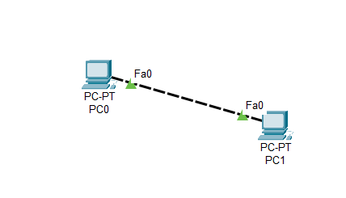
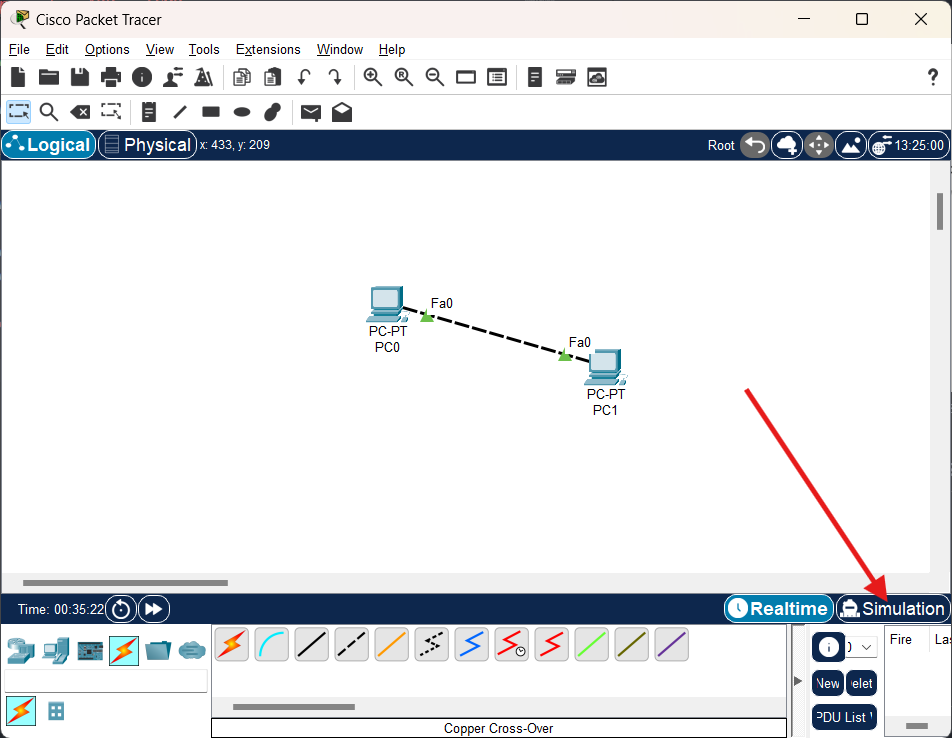
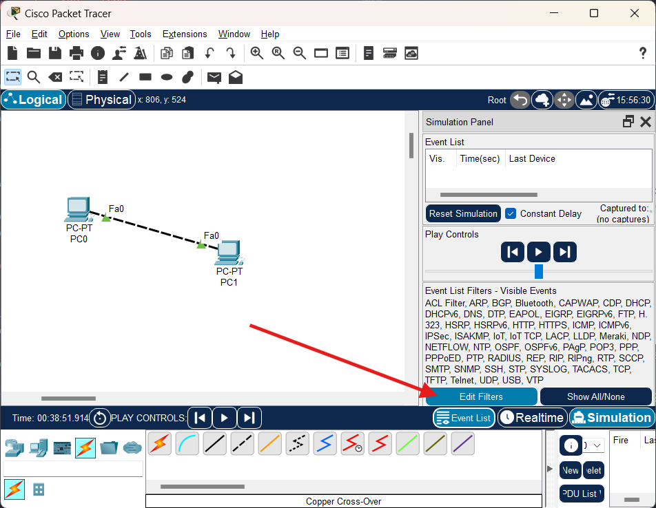
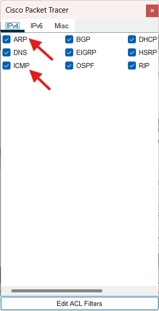
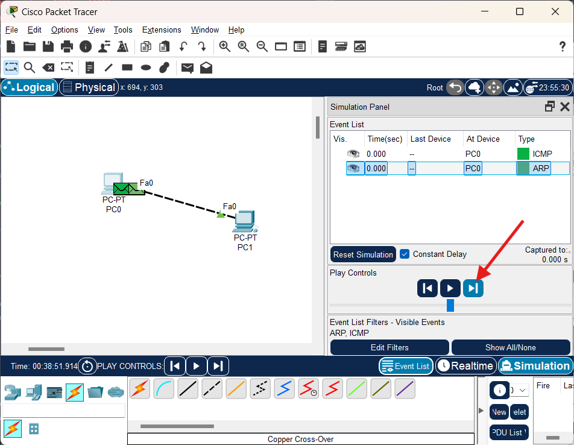
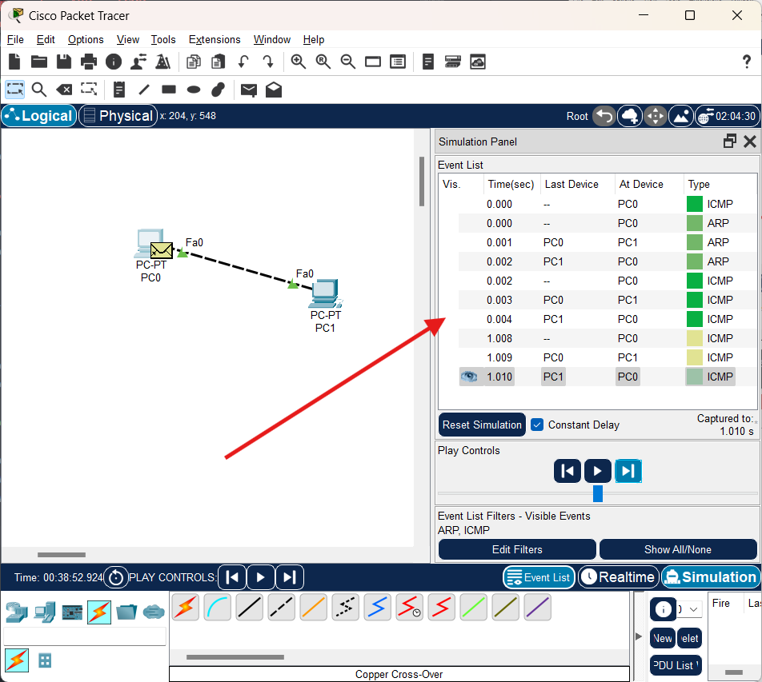
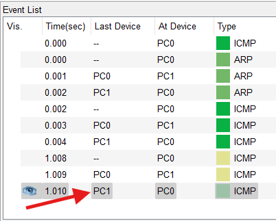
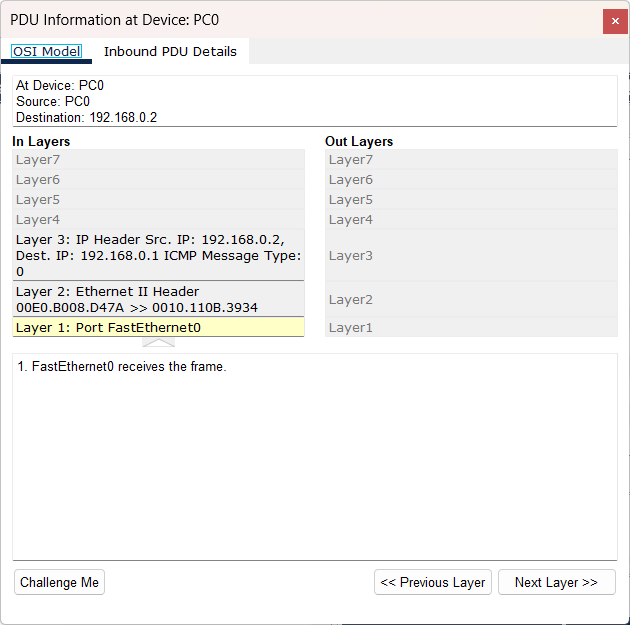

# Contenido S3

- [Captura de paquetes ARP e ICMP](#captura-de-paquetes-arp-e-icmp)
  - [Configuración de IPs en VPC](#configuracion-de-ips)
  - [Entrando al modo simulación](#modo-simulacion)
  - [Solicitud ARP y protocolo ICMP en modo simulacion](#solicitud-arp-y-protocolo-icmp-en-modo-simulacion)
- [Tabla ARP en VPC](#tabla-arp-en-vpc)
- [Modos de operacion en dispositivos Cisco](#modos-de-operacion-en-dispositivos-cisco)
- [Comandos basicos de Switch con IOS](#comandos-basicos-de-switch-con-ios)
  - [Comentarios](#comentarios)
  - [Colocar contraseña de acceso](#colocar-contraseña-de-acceso)
    - [Contraseña al modo EXEC de usuario](#contraseña-al-modo-exec-de-usuario)
    - [Contraseña al modo EXEC privilegiado](#contraseña-al-modo-exec-privilegiado)
    - [Contraseña por sesión remota](#contraseña-por-sesion-remota)
  - [Cambio de mensaje en banner inicial](#cambio-de-mensaje-en-banner-inicial)
  - [Cambio de nombre](#cambio-de-nombre)
  - [Revertir una configuración](#revertir-una-configuracion)
  - [Guardar configuración del dispositivo](#guardar-configuracion-del-dispositivo)

# Captura de paquetes ARP e ICMP

Para el ejemplo se conectan físicamente dos computadoras utilizando un cable Cross-Over



Luego se establecen IP estáticas para cada PC

## Configuracion de IPs

| PC  |     IP      |
|:---:|:-----------:|
| PC0 | 192.168.0.1 |
| PC1 | 192.168.0.2 |

## Modo Simulacion

Se ingresa en el modo simulación presionando el botón `Simulation` situado en la parte inferior derecha de la pantalla, o con el atajo en el teclado `Shift + S`



Luego se presiona el botón de `Edit Filters` que mostrará los tipos de eventos que se desean visualizar en el modo simulación



Esto desplegará el siguiente menú



Se dejan activados (con el checkbox azul) únicamente los de interés. Para el ejemplo actual se dejan seleccionados `ARP` e `ICMP` y se desactivan los demás.

## Solicitud ARP y protocolo ICMP en modo simulacion

Desde el Command Prompt de cualquier PC se realiza un ping hacia la otra PC. Para este ejemplo se selecciona el PC0 y se realiza el ping hacia la PC1.

En la simulación se visualizará paso por paso el proceso de la solicitud ARP y el protocolo ICMP.

Se puede ir de paso en paso presionando el botón `Siguiente` que se encuentra en la parte simulada, para ir avanzando en cada paso.



Al ir avanzando, se mostrará en la sección de `Even List` todos los eventos que han generado el proceso de la solicitud ARP y el protocolo ICMP.



Ya que la PC la primera vez que realiza el ping, no conoce la dirección física del dispositivo al cual quiere llegar, primero se crea una trama cuyo destino es la dirección IP de broadcast donde se incluye la dirección de destino a la que se desea localizar y luego, al reolver y almacenar su ubicación, continúa con el protocolo ICMP para continuar con los mensajes de control.

Si se desea obtener mayor información de la trama, se puede seleccionar cualquier item que se encuentra en esta lista de `Even List` (dando click en él) y obtener más información de dicho evento.



Al seleccionar el ítem se muestra información detallada del evento. En este se puede observar qué capas del modelo OSI maneja el protocolo, y los detalles del PDU.



## Tabla ARP en VPC

```
# Mostrar la tabla ARP (dispositivos ya almacenados)
arp -a

# Eliminar todos los dispositivos en tabla ARP
arp -d
```

## Modos de operacion en dispositivos Cisco

Al accesar a un dispositivo de cisco primero aparecerá el nombre del dispositivo seguido de un prompt que determina el modo (o nivel) en el que se encuentra. Los tipos de modos que más serán utilizados en el laboratorio son los siguientes:

|                   Modo                |     Prompt      | ¿Qué permite hacer? | 
|:-------------------------------------:|:--------------:|:------------------------------------------------:| 
| Modo usuario (Exec de usuario)        | >              | Solo ver información básica (no configuración) |
| Modo privilegiado (Exec privilegiado) | #              | Ver configuraciones completas y guardar cambios (Requiere "enable" en modo usuario) |
| Modo configuración global             | (config)#      | Cambiar la configuración del dispositivo (Requiere "configure terminal" en modo privilegiado) |
| Modo interfaz                         | (config-if)#   | Configurar puertos físicos o lógicos (Modo Acceso/Troncal, IP, etc) |
| Modo de línea                         | (config-line)# | Configurar accesos remotos como consola o SSH |

# Comandos basicos de Switch con IOS

Al conectarse a algún switch puede aparecer una pantalla en el que se muestra lo siguiente

```
Switch>
```

Ese apartado muestra el nombre del dispositivo (Switch) y el símbolo "`>`". Este símbolo indica que se encuentra en el modo EXEC de usuario.

En dicho modo se tiene acceso a un número limitado de comandos. Para ver los comandos disponibles se puede colocar el signo de interrogación cerrado "`?`" y con esto saldrá un listado con todos los comandos disponibles

```
Switch> ?
Exec commands:
  connect     Open a terminal connection
  disable     Turn off privileged commands
  disconnect  Disconnect an existing network connection
  enable      Turn on privileged commands
  exit        Exit from the EXEC
  logout      Exit from the EXEC
  ping        Send echo messages
  resume      Resume an active network connection
  show        Show running system information
  ssh         Open a secure shell client connection
  telnet      Open a telnet connection
  terminal    Set terminal line parameters
  traceroute  Trace route to destination
```

Entre estos comandos, por ejemplo, aparece el comando "`ping`".

El comando "`enable`" es el comando que permite subir de nivel y entrar a modo EXEC privilegiado, el cual permitirá indagar más en la configuración del dispositivo.

Al utilizar el comando "`enable`" se puede visualizar que el simbolo ">" cambió a "#"; esto indica que estamos en modo EXEC privilegiado. Para salir de este modo y volver al modo EXEC de usuario se usa el comando "`exit`".

```
Switch> enable
Switch#
```

Dentro del modo EXEC privilegiado también hay una larga lista de comandos disponibles para su uso. En este modo se tienen 2 comandos importantes, "`show running-config`", el cual muestra la configuración del dispositivo y "`copy running-config startup-config`" que guarda la configuración del mismo. También se puede usar el comando "`write`" (en lugar del comando anterior) para guardar la configuración del dispositivo.

Pero en este modo no se puede realizar la configuración del dispositivo, por lo que para realizar esto se necesita usar el comando "`configure terminal`" en el modo EXEC privilegiado. Esto pondrá al dispositivo en el modo de configuración global.

```
Switch# configure terminal
Enter configuration commands, one per line. End with CNTL/Z.
Switch(config)#
```

En este modo se podrá configurar completamente el dispositivo. Para salir del modo podemos usar "`exit`", "`end`" o el atajo del teclado "`ctrl+Z`".

## Comentarios

En este sistema operativo se pueden colocar líneas con comentarios que pueden ayudar a facilitar la lectura de los comandos utilizados. Para esto se debe de colocar el símbolo "`!`" seguido de lo que se desee agregar, por ejemplo:

```
Switch(config)# ! Este es un comentario
```

## Colocar contraseña de acceso

Existen varias opciones para colocar una contraseña al switch según el nivel en el que se encuentre.

### Contraseña al modo EXEC de usuario

Para colocar una contraseña desde la conexión física del dispositivo por medio de un cable de consola, es decir, antes de ingresar al modo EXEC de usuario, se realiza lo siguiente:

1. Primero se debe de ingresar en el modo de configuración global en el dispositivo, ejemplo:

```
Switch> enable
Switch# configure terminal
```
Dentro de este modo ya se pueden usar los siguientes comandos:

```
Switch(config)# line console 0
Switch(config-line)# password miClave
Switch(config-line)# login
Switch(config-line)# exit
```

Esto obliga a ingresar la contraseña `miClave` (como en el ejemplo) al conectar físicamente con el dispositivo y querer ingresar al modo de EXEC de usuario.

### Contraseña al modo EXEC privilegiado

Para colocar una contraseña, al querer ingresar al modo EXEC Privilegiado, se pueden usar dos comandos:

#### Forma 1 (En el modo de configuración global)

```
Switch(config)# enable password miClaveSegura
```

Con este comando se almacena la contraseña `miClaveSegura` en el dispositivo y se debe de ingresar para poder entrar al modo EXEC Privilegiado.

La desventaja de utilizar este comando es que no utiliza un cifrado por lo que al entrar a visualizar la configuración del dispositivo con el comando "`show running-config`" se mostrará la contraseña de la siguiente forma:

```
enable password miClaveSegura
```

Para evitar esto, se puede colocar el comando "`service password-encryption`" en el modo de configuración global. Este comando aplica una cifra reversible (tipo 7) que se encuentran en la configuración del dispositivo.
```
Switch(config)# service password-encryption
Switch(config)# enable password miClaveSegura
```

De esta forma, al correr el comando "`show running-config`" se mostrará la contraseña con algo parecido a la siguiente forma:

```
enable password 7 060506324F41
```

Nota: El número es el resultado de la encriptación tipo 7 de Cisco, que puede ser revertida con herramientas especializadas.

#### Forma 2 (En el modo de configuración global)

```
Switch(config)# enable secret miClaveSegura
```

Esto almacena la contraseña con un hash MD5, lo que la hace mucho más difícil de revertir.

Con este comando se almacena la contraseña `miClaveSegura` en el dispositivo utilizando un hash MD5, lo que la hace mucho más dificil de revertir.

### Contraseña por sesion remota

Para colocar una contraseña desde la conexión remota (Telnet/SSH) del dispositivo por medio de un cable de consola se pueden usar los siguientes comandos en el modo de configuración global:

```
Switch(config)# line vty 0 15
Switch(config-line)# password miClave
Switch(config-line)# login
Switch(config-line)# exit
```

Esto obliga a ingresar la contraseña `miClave` (como en el ejemplo) al conectar de forma remota con el dispositivo.

## Cambio de mensaje en banner inicial

Se puede colocar un mensaje en el banner de login, que aparecerá al iniciar el dispositivo. Esto se realiza con el comando "`banner motd $MENSAJE_A_MOSTRAR$`" dentro del modo de configuración global. Por ejemplo:

```
SW1(config)# banner motd $Solo Usuarios Autorizados$
```

Por lo que antes de entrar al modo EXEC de Usuario aparecerá lo siguiente:

```
Solo Usuarios Autorizados

SW1>
```

## Cambio de nombre

Para poderle cambiar el nombre al dispositivo se puede usar el comando "`hostname`" seguido del nombre que se desea colocar en el modo de configuración global, por ejemplo:

```
Switch(config)# hostname SW1
SW1(config)# 
```

El resultado muestra que el nombre predeterminado (Switch) se cambió a SW1.

## Revertir una configuracion

Se puede revertir alguna configuración que ya no se desea. Esto se logra simplemente colocando el comando "`no`" seguido por el comando que se ingresó. 

Por ejemplo, si se desea revertir el mensaje de banner inicial, basta con colocar el comando

```
SW1(config)# no banner motd
```

Con este comando se revierte la configuración del banner de login, por lo que ya no aparecerá el mensaje configurado.

## Guardar configuracion del dispositivo

Dentro del modo EXEC privilegiado se tiene el comando "`copy running-config startup-config`" que guarda la configuración del mismo. También se puede usar el comando simplificado "`write`" para guardar la configuración del dispositivo.

Un ejemplo sería el siguiente:

```
SW1# write
```

