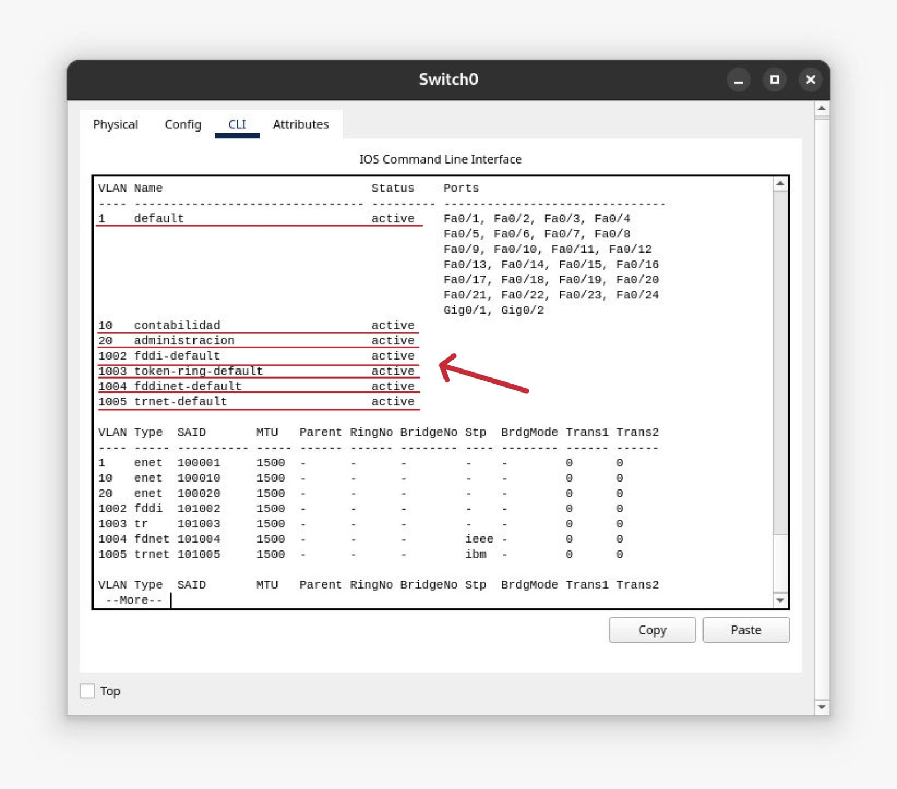
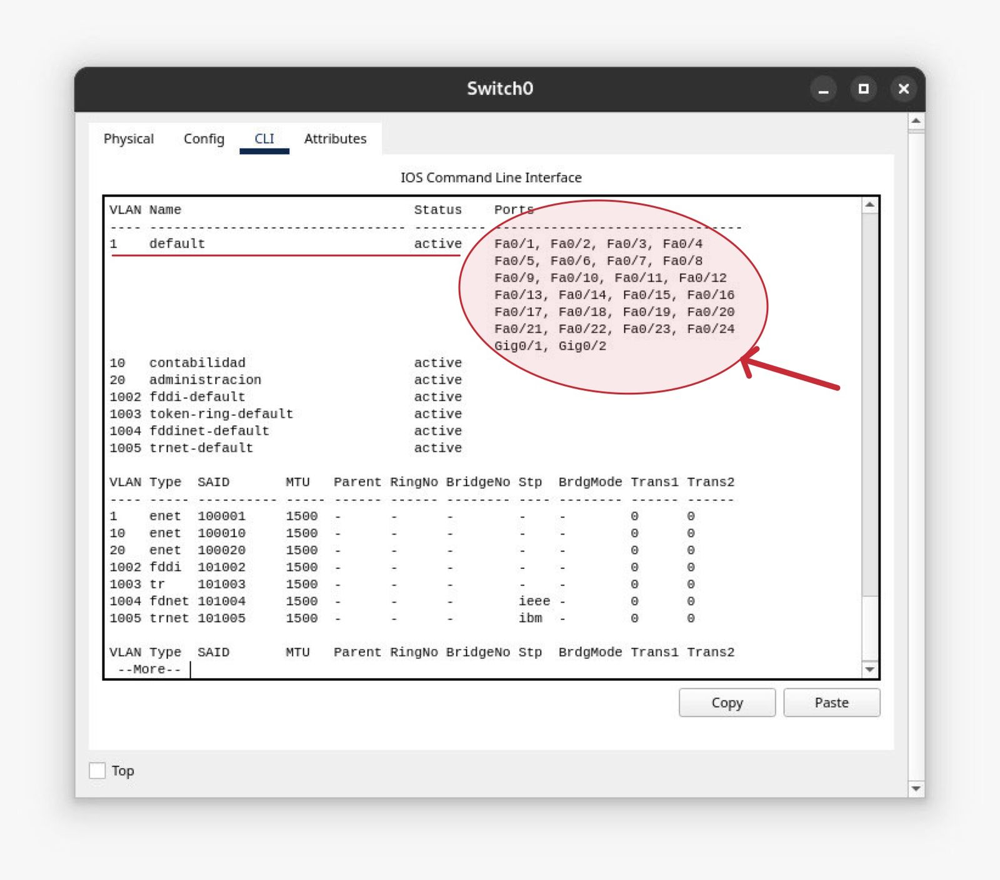
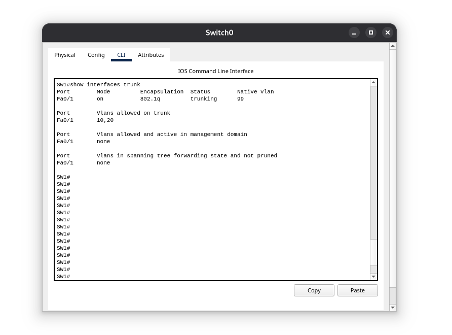
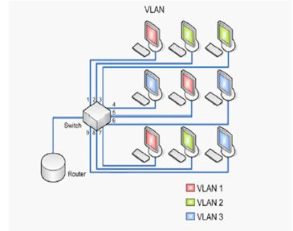

# Contenido Semana 4

- [VLANS](#vlans)
  - [Creación de VLANs](#creación-de-vlans)
  - [Configuración Enlace en modo Troncal](#configuración-enlace-en-modo-troncal)
  - [Configuración Enlace en modo Acceso](#configuración-enlace-en-modo-acceso)
  - [Verificación de la configuración](#verificación-de-la-configuración)
- [VTP - Protocolo de troncalización de VLAN](#vtp---protocolo-de-troncalización-de-vlan)
  - [Comandos importantes en VTP](#comandos-importantes-en-vtp)
  - [Creación VTP modo servidor](#creación-vtp-modo-servidor)
  - [Creación VTP modo cliente](#creación-vtp-modo-cliente)
  - [Creación VTP modo transparente](#creación-vtp-modo-transparente)

# VLANS

Las VLANs (Virtual Local Area Networks) permiten segmentar una red en múltiples dominios de broadcast, mejorando el rendimiento y la seguridad.

En un switch Cisco, las VLANs están configuradas por un campo de 12 bits y pueden crearse en los siguientes rangos de números:

- VLANs estándar: 1 - 1005
    - La VLAN 1 es la VLAN predeterminada y no se puede eliminar.
    - Las VLANs 1002-1005 están reservadas para Token Ring y FDDI y no pueden ser eliminadas ni modificadas.

- VLANs extendidas: 1006 - 4094
    - Requieren que el switch esté en modo VTP transparente o VTP versión 3 para poder ser configuradas.

En switches más recientes o en configuraciones avanzadas, puedes usar VLANs en todo el rango de 2 a 4094, excepto las reservadas.

Sin embargo, no todas estas VLANs son utilizables debido a restricciones específicas:

- VLAN 0:
    - Se reserva para tráfico no etiquetado y no puede ser utilizada como una VLAN normal.
    - Se usa en algunas configuraciones para indicar que un paquete no pertenece a ninguna VLAN específica.

- VLAN 4095:
    - Está reservada internamente por Cisco y no puede asignarse a puertos o configurarse manualmente.
    - En algunos dispositivos se usa para filtrar tráfico en hipervisores o redes virtuales.

Por eso, aunque el rango binario va de 0000 0000 0000 (0) a 1111 1111 1111 (4095), solo las VLANs 1-4094 son reconocidas en la práctica.

## Creación de VLANs

Para la creación de una VLAN se utiliza el comando `VLAN [id]` en el modo de configuración global. En donde [id] puede ser un número entre 1 y 4094. También se puede especificar un nombre a la VLAN creada, usando el comando `name [nombre]`, en donde [nombre] será el nombre que se le desea colocar a la VLAN. Por ejemplo para crear la vlan 50 con el nombre ADMIN se realiza lo siguiente

```bash
configure terminal
    vlan 10
    name ADMIN
    exit
```

## Configuración Enlace en modo Troncal

Para configurar el modo troncal necesitamos acceder a la interfaz que queremos configurar en dicho modo y usar los comandos:

```bash
configure terminal
    interface FastEthernet 0/1 # Por ejemplo esta interfaz
    switchport trunk encapsulation dot1q # Este comando no es necesario en modelos recientes
    switchport mode trunk
    # Una buena práctica de seguridad es cambiar la VLAN Nativa (que por defecto es la VLAN1) 
    switchport trunk native vlan 99 # Para este ejemplo la vlan 99 se está utilizando para que sea la VLAN Nativa
    # También es importante colocar las VLAN's que tienen permitido pasar por este puerto
    switchport trunk allowed vlan 10,20,30 # Para el ejemplo se está configurando que solo estas 3 VLAN pueden viajar en la interfaz
    exit
```


## Configuración Enlace en modo Acceso

Para configurar el modo acceso y definirle una VLAN necesitamos acceder a la interfaz que queremos configurar en dicho modo y usar los comandos:

```bash
configure terminal
    interface FastEthernet 0/2 # Por ejemplo esta interfaz
    switchport mode acces
    switchport acces vlan 10 # Aquí se establece la vlan 10 para ese puerto
    exit
```

## Verificación de la configuración

Para ver las VLANS del dispositivo usamos el comando `"show vlan"` en el modo EXEC privilegiado



Se muestra un listado de las vlan que están creadas. Para este ejemplo está la VLAN 1 que es la que viene por defecto y en la que se encuentran asignados todos los puertos. También está la VLAN 10 y la VLAN 20 cada una con su respectivo nombre y las VLANs 1002-1005 que son predefinidas por cisco.

Con este comando anterior(`"show vlan"`) también se podrán visualizar los puertos en modo acceso y la VLAN a la cual se encuentran asignada.



Para ver el estado del modo troncal en el dispositivo usamos el comando `"show interfaces trunk"`




# VTP - Protocolo de troncalización de VLAN

Es un protocolo de red que permite a los dispositivos en una red compartir información sobre las VLAN. Esto simplifica la configuración de las VLAN y asegura que los dispositivos tengan la misma información sobre las VLAN en toda la red.



## Comandos importantes en VTP

Los siguientes comandos serán de mucha ayuda tanto para crear el modo de funcionamiento, así como para visualizar las configuraciones.

```bash
# Comandos en modo configuración global
vtp mode [tipo] # Para definir el modo de funcionamiento (servidor, cliente, transparente)
vtp domain [nombre_dominio] # Para definir el dominio de nuestro servidor
vtp password [password] # Para definir el password de nuestro dominio
vtp version [numero] # Define las características a emplear, por lo general se usará la version 2
# Comandos en modo de EXEC Privilegiado
show vtp status # Muestra el dominio y versión de nuestro vtp, así como la cantidad de VLAN que se están pasando
show vtp password # Muestra la contraseña asignada a la configuración vtp
show vlan brief # Muestra un resumen de las VLAN que están en el dispositivo.
```

## Creación VTP modo servidor

En este modo, los switches pueden crear, modificar o eliminar VLAN y propagar esa información a otros switches en la red VTP. El modo servidor es el modo predeterminado para la mayoría de los switches.

Para crearlo se utilizarán los siguientes comandos
```bash
configure terminal
vtp version 2
vtp mode server
vtp domain [nombre_dominio]  # Ejemplo vtp domain redes1
vtp password [password] # Ejemplo password 12345
```

## Creación VTP modo cliente

En este modo, los switches reciben actualizaciones de VLAN de los switches en modo servidor, pero no pueden crear, modificar o eliminar VLAN. Los cambios en VLAN solo pueden ser realizados por switches en modo servidor.

Para crearlo se utilizarán los siguientes comandos
```bash
configure terminal
vtp version 2
vtp mode client
# El dominio tiene que ser el mismo utilizado en el servidor
vtp domain [nombre_dominio]  # Ejemplo vtp domain redes1
# El password tiene que ser el mismo utilizado en el servidor
vtp password [password] # Ejemplo password 12345
```

## Creación VTP modo transparente

En este modo, los switches no participan en la propagación de información de VLAN a través de la red VTP. Los switches en modo transparente simplemente pasan a través cualquier tráfico de VLAN que reciben y no realizan ningún cambio en la configuración de VLAN de la red.

Para crearlo se utilizarán los siguientes comandos
```bash
configure terminal
vtp version 2
vtp mode transparent
# El dominio tiene que ser el mismo utilizado en el servidor
vtp domain [nombre_dominio]  # Ejemplo vtp domain redes1
# El password tiene que ser el mismo utilizado en el servidor
vtp password [password] # Ejemplo password 12345
```

Es importante tener en cuenta que los cambios realizados en un switch en modo transparente no se propagan automáticamente a través de la red VTP. Cualquier cambio realizado en un switch en modo transparente debe ser realizado manualmente en cada uno de los switches conectados a la red.

Para que el protocolo VTP funcione, todos los switches que participan deben de tener configurada la misma versión, el mismo dominio y la misma contraseña.
