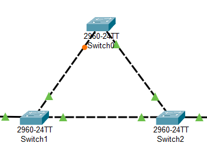
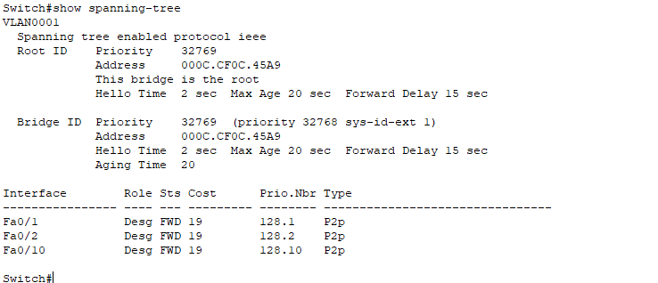

# Contenido Semana 5

- [Spanning Tree Protocol (STP)](#spanning-tree-protocol-stp)
  - [Gráfico completo](#gráfico-completo)
  - [Configuración de protocolo STP](#configuración-de-protocolo-stp)
    - [Configuración para el Root Bridge](#configuración-para-el-root-bridge)
    - [Configuración para STP en demás switches](#configuración-para-stp-en-demás-switches)
  - [Modos de configuración de STP](#modos-de-configuración-de-stp)
    - [Modo por Defecto (PVST o PVST+)](#modo-por-defecto-pvst-o-pvst)
    - [Modo Rapid PVST](#modo-rapid-pvst)
  - [Verificación de la configuración](#verificación-de-la-configuración)
  - [Script de comandos realizados en clase](#script-de-comandos-realizados-en-clase)
- [Sintaxis de Cisco IOs en Sublime Text (Extra)](#sintaxis-de-cisco-ios-en-sublime-text-extra)

# Spanning Tree Protocol (STP)
Spanning Tree Protocol (STP) es un protocolo de capa 2 utilizado para evitar bucles en redes Ethernet conmutadas.

## Gráfico completo

En la siguiente imágen se muestra una red totalmente enmallada



En un árbol de expansión (Spanning Tree) no se conectan totas las conexiones posibles sino solo las necesarias para que todo esté comunicado, evitando ciclos.

Para verificar la configuración del protocolo STP en cualquiera de los switches, se debe de ingresar en el modo de ejecución privilegiada y se utiliza el comando

```bash
show spanning-tree
```
Lo que mostrará algo similar a la siguiente configuración



En la anterior imágen se puede ver la VLAN con la que trabaja el protocolo, en este caso `VLAN 0001` (o `VLAN 1`). También se puede ver el tipo de protocolo habilitado, en este caso `"protocol ieee"` equivale al spanning tree normal. Este protocolo se activa de manera predeterminada en los switches (no es el único tipo de STP).

También se indica que la raíz está en el actual switch. Esto se puede visualizar con la línea `"This bridge is the root"`.

También el comando muestra un listado de interfaces, en el que se puede visualizar su rol (Role), estado (Sts) y costo (Cost). Esta información es importante al momento de poder describir el funcionamiento del STP.

Un rol `Root` implica que se trata de la conexión con el camino hacia el switch raíz.
Un rol `Desg` se trata de una conexión que si bien no es para la raíz, el algoritmo determinó que no representa un riesgo de loop y por lo tanto es el puerto que permite reenviar tráfico en un segmento de red.
Un rol `Altn` es el que se encuentra en modo de reserva. Este actúa como respaldo del Root Port. Cuando se encuentra en este modo entra en modo de bloqueo y entra en funcionamiento si el Root Port o el puerto designado fallan.

La parte más importante es el estado. Un puerto en estado `LIS` está escuchando y aprendiendo la topología de la red, un puerto en estado `FWD` va a permitir el paso de la información y por último un puerto en estado `BLK` no permitirá la transmisión de datos.

## Configuración de protocolo STP

### Configuración para el Root Bridge
Para mejorar la estabilidad de la red y optimizar la convergencia, se establece un Root Bridge para cada VLAN.

El comando para su configuración, estando en el modo de configuración global, es la siguiente:

```bash
spanning-tree vlan <vlan o lista de vlans> root primary
# Ejemplo
spanning-tree vlan 1,2,3,10-15,20 root primary
```

### Configuración para STP en demás switches

A los demás switches se debe de colocar un comando similar que al que se establece en el Root Bridge, a excepción de `root primary` ya que esta parte solo es para el switch root. El comando quedaría de esta manera para los demás dispositivos (en el modo de configuración global)

```bash
spanning-tree vlan <vlan o lista de vlans>
# Ejemplo
spanning-tree vlan 1,2,3,10-15,20
```

## Modos de configuración de STP
Existen diferentes versiones y modos de configuración de STP:

### Modo por Defecto PVST o PVST+
El modo predeterminado en switches Cisco es Per VLAN Spanning Tree Plus (PVST+). Este modo crea una instancia independiente de STP para cada VLAN, lo que permite una mejor optimización del tráfico y la redundancia en la red.

### Modo Rapid PVST
Este modo utiliza Rapid Per VLAN Spanning Tree (Rapid PVST+), basado en el estándar IEEE 802.1w, mejorando la velocidad de convergencia de STP y reduciendo el tiempo de recuperación en caso de fallos.

Para configurar un modo del protocolo de árbol de expansión se pueden utilizar los siguientes comandos en el modo de configuración global

```bash
# Modo Per-Vlan Spanning Tree (PVST)
spanning-tree mode pvst
# Modo Per-Vlan Rapid Spanning Tree (Rapid PVST)
spanning-tree mode rapid-pvst
```

IMPORTANTE: Independiente del modo, este debe de estar configurado en todo el gráfico completo, es decir, en todos los switches que participan en el protocolo, deben de tener el mismo modo de configuración STP.

## Verificación de la configuración

Para ver un poco más de detalle el protocolo STP, dentro del modo de configuración global, se puede utilizar el comando:

```bash
show spanning-tree
```

Si se quisiera tener un poco más de detalle, se puede utilizar el comando:

```bash
show spanning-tree detail
```

También se pueden visualizar los puertos que se encuentran bloqueados con el comando

```bash
show spanning-tree blockedports
```

## Script de comandos realizados en clase

## Switch Servidor
```bash
enable 
configure terminal
  ! Establecer nombre
  hostname SERVIDOR
  ! Estableciendo VTP
  vtp mode server
  vtp version 2
  vtp domain Redes1
  vtp password 12345
  ! crear vlans
  vlan 10
    name COMPRAS
    exit
  vlan 20
    name VENTAS
    exit
  ! Configurando interfaces (puertos)
  interface range FastEthernet 0/1-2
    ! Estableciendo modo troncal
    switchport trunk encapsulation dot1Q
    switchport mode trunk
    ! Estableciendo vlans con las que se trabajarán
    switchport trunk allowed vlan 10,20
    exit
  exit
  write
```

## Switch Cliente01
```bash
enable 
configure terminal
  ! Establecer nombre
  hostname CLIENTE01
  ! Estableciendo VTP
  vtp mode client
  vtp version 2
  vtp domain Redes1
  vtp password 12345
  ! Configurando interfaces (puertos) troncales
  interface range FastEthernet 0/1-2
    ! Estableciendo modo troncal
    switchport trunk encapsulation dot1Q
    switchport mode trunk
    ! Estableciendo vlans con las que se trabajarán
    switchport trunk allowed vlan 10,20
    exit
  ! Configurando interfaces (puertos) de acceso
  interface FastEthernet 0/10
    switchport mode access
    switchport access vlan 20
    exit
  interface FastEthernet 0/11
    switchport mode access
    switchport access vlan 10
    exit
  exit
```

## Switch Cliente02
```bash
enable 
configure terminal
  ! Establecer nombre
  hostname CLIENTE02
  ! Estableciendo VTP
  vtp mode client
  vtp version 2
  vtp domain Redes1
  vtp password 12345
  ! Configurando interfaces (puertos) troncales
  interface range FastEthernet 0/1-2
    ! Estableciendo modo troncal
    switchport trunk encapsulation dot1Q
    switchport mode trunk
    ! Estableciendo vlans con las que se trabajarán
    switchport trunk allowed vlan 10,20
    exit
  ! Configurando interfaces (puertos) de acceso
  interface FastEthernet 0/10
    switchport mode access
    switchport access vlan 10
    exit
  interface FastEthernet 0/11
    switchport mode access
    switchport access vlan 20
    exit
  exit
```

## Sintaxis de Cisco IOs en Sublime Text (Extra)

1. Dentro de Sublime text presionan el atajo del teclado `Control+Shift+P` para abrir la paleta de comandos
2. En la barra de búsqueda colocan `Install Package Control` para instalar el Control de Paquetes (les daldrá un mensaje que ya fue instalado)
3. Ya que haya instalado, vuelven a presionar el atajo del teclado `Control+Shift+P` para abrir la paleta de comandos
4. En la barra de búsqueda colocan `Package Control: Install Package` 
5. Les tiene que salir una nueva barra de búsqueda. En esta colocan `Network Tech` y la seleccionan.
6. En la parte inferior de la ventana de Sublime Text les aparecerá un mensaje en donde está cargando el paquete y luego ya cuando esté instalado.

Para seleccionar la sintaxis lo pueden hacer de dos formas
1. Abren la paleta de comandos (`Control+Shift+P`), colocan en la barra `Cisco` y seleccionan la opción de `Set Sintax: Cisco IOS`
2. En el menú superior ingresan a: `View / Sintax / Network Tech` y seleccionan el de `Cisco IOS`

