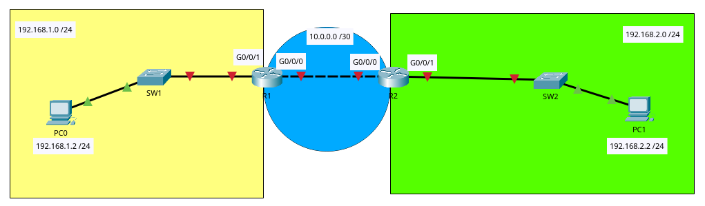
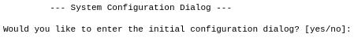

# Contenido Semana 8

- [Enrutamiento Estático](#enrutamiento-estático)
  - [Características](#características)
  - [Ejemplo de Configuración](#ejemplo-de-configuración)
  - [Creando enrutamiento](#creando-enrutamiento)
  - [Configuración Completa de Routers](#configuración-completa-de-routers)
    - [R1](#r1)
    - [R2](#r2)
  - [Video ejemplo práctico](#video-ejemplo-práctico)

# Enrutamiento Estático

Este es un método en el que el administrador de la red configura manualmente las rutas en cada enrutador. En este método las rutas no cambian a menos que el administrador las modifique.

## Características

- La configuración es manual por parte del administrador
- No consume ancho de banda porque no envía actualizaciones de rutas
- Más seguro, ya que no depende de otros protocolos externos
- Adecuado para redes pequeñas o con poca variabilidad en la topología

## Ejemplo de Configuración

Suponiendo la siguiente red:



Es posible que al ingresar la primera vez en un router, muestre el siguiente mensaje:



El cual se debe escribir `no`, ya que se realizarán las configuraciones manuales.

También se debe de mencionar que los puertos de los routers por lo general se mantienen apagados, por lo que se debe de ingresar al puerto que se desa utilizar y encenderlo con el comando:

```bash
no shutdown
```

Las PC tendrán las siguientes configuraciones:

| PC  | Dirección IP | Máscara de Subred | Puerta de enlace predeterminada |
| --- | ------------ | ----------------- | ------------------------------- |
| PC0 | 192.168.1.2  | 255.255.255.0     | 192.168.1.1                     |
| PC1 | 192.168.2.2  | 255.255.255.0     | 192.168.2.1                     |

Tal como se muestra en la tabla anterior, ambas PC tienen una puerta de enlace predeterminada. Esta dirección servirá como punto de salida para el tráfico que será dirigido a redes que se encuentran fuera de dicha red. Por lo general esta dirección se debe de configurar en el dispositivo que dará salida a la red, ya sea en un router o en un switch de capa 3, por lo que estas direcciones se deben de configurar en cada router (puerto GigabitEthernet 0/0/1 según este ejemplo) respectivamente.

Para hacer esto, se ingresa al puerto necesario (el que conecta el router con el switch en este ejemplo) y se ingresa el comando

```bash
enable
configure terminal
interface [interfaz]/[puerto]
ip address [direccion] [mascara de subred]
```

Para este ejemplo la configuración de la IP del puerto quedaría de la siguiente manera:

```bash
# Router R1
enable
configure terminal
interface GigabitEthernet 0/0/1
ip address 192.168.1.1 255.255.255.0
exit

# Router R2
enable
configure terminal
interface GigabitEthernet 0/0/1
ip address 192.168.2.1 255.255.255.0
exit
```

En ambos routers también se debe establecer una dirección IP entre la conexión entre ellos (R1<->R2) por lo que esta queda de la siguiente forma:
```bash
# Router R1
enable
interface GigabitEthernet 0/0/0
ip address 10.0.0.1 255.255.255.252
exit

# Router R2
interface GigabitEthernet 0/0/0
ip address 10.0.0.2 255.255.255.252
exit
```

## Creando enrutamiento

En cada red se debe de configurar la ruta al querer sacar el paquete de la red, como al quererlo regresar. El comando que se utiliza es el siguiente

```bash
# En el modo de configuración global
ip route [red_destino] [mascara_subred_destino] [ip_siguiente_salto]
```

En donde:
- red_destino: Es el ID de la Red a la que se desea llegar.
- mascara_subred_destino: Es la máscara de subred que tiene la Red de destino.
- ip_siguiente_salto: La siguiente IP (fuera del router) que será la que ayude a llegar a la red a la cual se desea llegar.

Para el ejemplo las rutas estáticas quedan de la siguiente forma:

```bash
# R1
ip route 192.168.2.0 255.255.255.0 10.0.0.2 
#Esto indica que para llegar a la red 192.168.2.0/24, el tráfico debe enviarse a 10.0.0.2
ip route 10.0.0.0 255.255.255.252 10.0.0.2
#Esto indica que para llegar a la red 10.0.0.0/30, el tráfico debe enviarse a 10.0.0.2

# R2
ip route 192.168.1.0 255.255.255.0 10.0.0.1
#Esto indica que para llegar a la red 192.168.1.0/24, el tráfico debe enviarse a 10.0.0.1
ip route 10.0.0.0 255.255.255.252 10.0.0.1
#Esto indica que para llegar a la red 10.0.0.0/30, el tráfico debe enviarse a 10.0.0.1
```

Con esto ya se establece conexión entre las redes.

## Configuración Completa de Routers

### R1

```bash
enable
configure terminal
interface GigabitEthernet 0/0/0
ip address 10.0.0.1 255.255.255.252
no shutdown
exit

interface GigabitEthernet 0/0/1
ip address 192.168.1.1 255.255.255.0
no shutdown
exit

# Estableciendo rutas estáticas
ip route 192.168.2.0 255.255.255.0 10.0.0.2
ip route 10.0.0.0 255.255.255.252 10.0.0.2
```

### R2

```bash
enable
configure terminal
interface GigabitEthernet 0/0/0
ip address 10.0.0.2 255.255.255.252
no shutdown
exit

interface GigabitEthernet 0/0/1
ip address 192.168.2.1 255.255.255.0
no shutdown
exit

# Estableciendo rutas estáticas
ip route 192.168.1.0 255.255.255.0 10.0.0.1
ip route 10.0.0.0 255.255.255.252 10.0.0.1
```
## Video ejemplo práctico

[](https://www.youtube.com/watch?v=l5e_v1BKB-g)