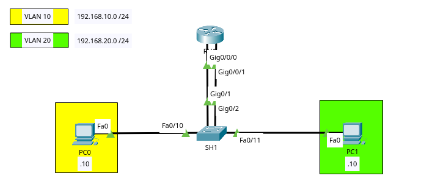
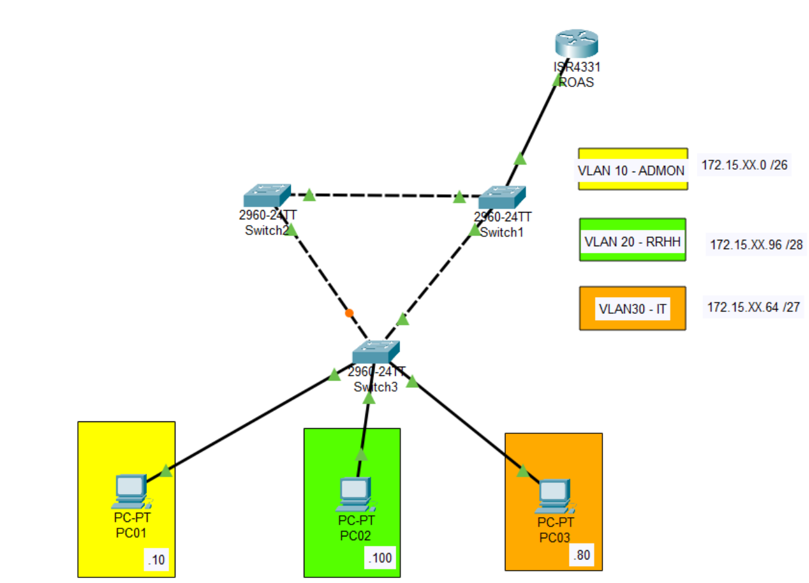
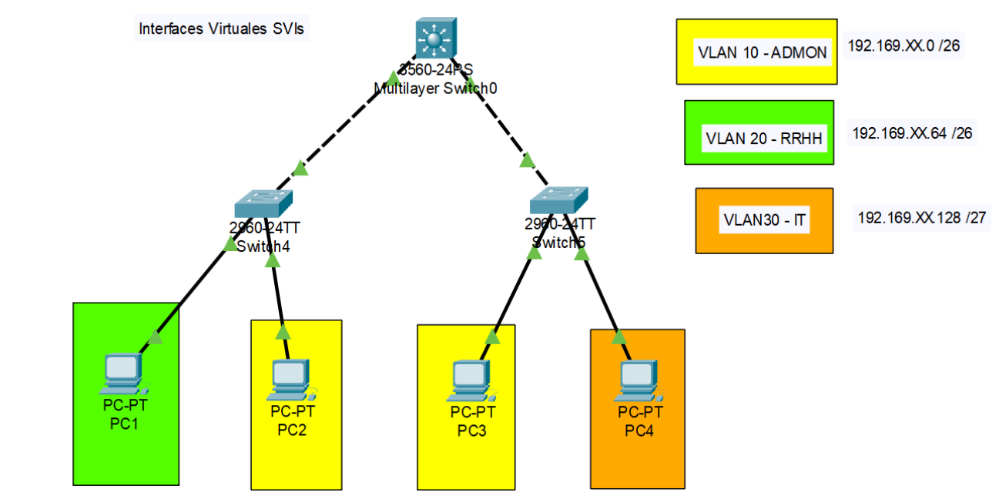

# Contenido Semana 10

- [Enrutamiento InterVLAN](#enrutamiento-intervlan)
  - [InterVLAN Routing Heredado](#intervlan-routing-heredado)
  - [Routing-on-a-stick](#routing-on-a-stick)
  - [Switch de Capa 3 con interfaces virtuales (SVIs)](#switch-de-capa-3-con-interfaces-virtuales-svis)

# Enrutamiento InterVLAN

## InterVLAN Routing Heredado



```bash
# SWITCH SH1
enable
configure terminal
  hostname SH1
  vlan 0
    exit
  vlan 20
    exit
  # Se da el acceso y se asigna vlan a cada dispositivo final
  interface FastEthernet 0/10
    switchport mode access
    switchport access vlan 10
    exit
  interface FastEthernet 0/11
    switchport mode access
    switchport access vlan 20
    exit
  # Se da el acceso y se asigna vlan a cada interfaz del router
  interface GigabitEthernet 0/1
    switchport mode access
    switchport access vlan 10
    exit
  interface GigabitEthernet 0/2
    switchport mode access
    switchport access vlan 20
    exit
  exit


# ROUTER RH1
enable
configure terminal
  hostname RH1
  # Se asigna la ip (gateway de cada red) en cada interfaz y se encienden
  interface GigabitEthernet 0/0/0
    ip address 192.168.10.1 255.255.255.0
    no shutdown
    exit
  interface GigabitEthernet 0/0/1
    ip address 192.168.20.1 255.255.255.0
    no shutdown
    exit
  exit
```

## Routing-on-a-stick



```bash
# SWITCH 1 (server)
enable
configure terminal
  hostname Server
  vlan 10
    name ADMON
    exit
  vlan 20
    name RRHH
    exit
  vlan 30
    name IT
    exit
  vtp version 2
  vtp mode server
  vtp domain cisco
  vtp password redes1
  interface range FastEthernet 0/1-2
    switchport mode trunk
    switchport trunk allowed vlan all
    exit
  interface GigabitEthernet 0/1
    switchport mode trunk
    switchport trunk allowed vlan all
    exit
  exit

# Switch 2 (Client01)
enable
configure terminal
  hostname Client01
  vtp version 2
  vtp mode client
  vtp domain cisco
  vtp password redes1
  interface range FastEthernet 0/1-2
    switchport mode trunk
    switchport trunk allowed vlan all
    exit
  exit


# Switch 3 (Client02)
enable
configure terminal
  hostname Client02
  vtp version 2
  vtp mode client
  vtp domain cisco
  vtp password redes1
  interface range FastEthernet 0/1-2
    switchport mode trunk
    switchport trunk allowed vlan all
    exit
  interface FastEthernet 0/10
    switchport mode access
    switchport access vlan 10
    exit
  interface FastEthernet 0/11
    switchport mode access
    switchport access vlan 20
    exit
  interface FastEthernet 0/12
    switchport mode access
    switchport access vlan 30
    exit
  exit

# Router ROAS
enable
configure terminal
  hostname ROAS
  # Se enciende la interfaz que estará activa para el tráfico de VLANs
  interface GigabitEthernet 0/0/0
    no shutdown
    exit
  # Se realizan las subinterfaces por cada vlan
  interface GigabitEthernet 0/0/0.10 # [interfaz].[vlan]
    encapsulation dot1Q 10 # Se indica con qué vlan trabajará dicha interfaz, en este caso 10
    ip address 172.15.XX.1 255.255.255.192
    exit
  interface GigabitEthernet 0/0/0.20
    encapsulation dot1Q 20 # Se indica con qué vlan trabajará dicha interfaz, en este caso 20
    ip address 172.15.XX.97 255.255.255.240
    exit
  interface GigabitEthernet 0/0/0.30
    encapsulation dot1Q 30 # Se indica con qué vlan trabajará dicha interfaz, en este caso 30
    ip address 172.15.XX.65 255.255.255.224
    exit
  exit


# IPs de Máquinas finales
PC01: 172.15.XX.10 255.255.255.192 (172.15.XX.1 Gateway)
PC02: 172.15.XX.100 255.255.255.240 (172.15.XX.97 Gateway)
PC03: 172.15.XX.80 255.255.255.224 (172.15.XX.65 Gateway)
```


## Switch de Capa 3 con interfaces virtuales (SVIs)



```bash
# Switch 4
enable
configure terminal
  hostname SW1
  vlan 10
    name ADMON
    exit
  vlan 20
    name RRHH
    exit
  interface FastEthernet 0/1
    switchport mode trunk
    switchport trunk allowed vlan all
    exit
  interface FastEthernet 0/10
    switchport mode access
    switchport access vlan 20
    exit
  interface FastEthernet 0/11
    switchport mode access
    switchport access vlan 10
    exit
  exit

# Switch 5
enable
configure terminal
  hostname SW2
  vlan 10
    name ADMON
    exit
  vlan 30
    name IT
    exit
  interface FastEthernet 0/1
    switchport mode trunk
    switchport trunk allowed vlan all
    exit
  interface FastEthernet 0/10
    switchport mode access
    switchport access vlan 10
    exit
  interface FastEthernet 0/11
    switchport mode access
    switchport access vlan 30
    exit
  exit


# Switch Capa 3
enable
configure terminal
  # Se indica al switch que actuará como enrutador
  ip routing
  hostname SC3
  # Se deben de crear todas las VLAN
  vlan 10
    name ADMON
    exit
  vlan 20
    name RRHH
    exit
  vlan 30
    name IT
    exit
  # Se establecen los enlaces en modo troncal
  interface range FastEthernet 0/1-2
    switchport trunk encapsulation dot1q # Este switch si utiliza este comando
    switchport mode trunk
    switchport trunk allowed vlan all
  # A cada interfaz vlan se le creará la ip que funcionará como gateway
  interface vlan 10
    ip address 192.169.XX.1 255.255.255.192
    exit
  interface vlan 20
    ip address 192.169.XX.65 255.255.255.192
    exit
  interface vlan 30
    ip address 192.169.XX.129 255.255.255.224
    exit
  exit

# IPs de Máquinas finales
PC1: 192.169.XX.69 255.255.255.192 (192.169.XX.65 Gateway)
PC2: 192.169.XX.3 255.255.255.192 (192.169.XX.1 Gateway)
PC3: 192.169.XX.4 255.255.255.192 (192.169.XX.1 Gateway)
PC4: 192.169.XX.130 255.255.255.224 (192.169.XX.129 Gateway)
```