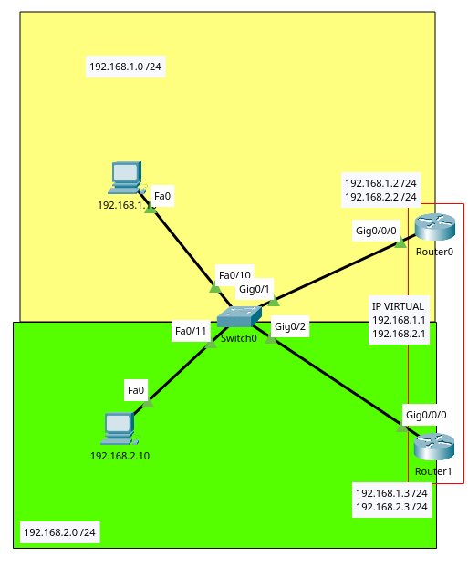
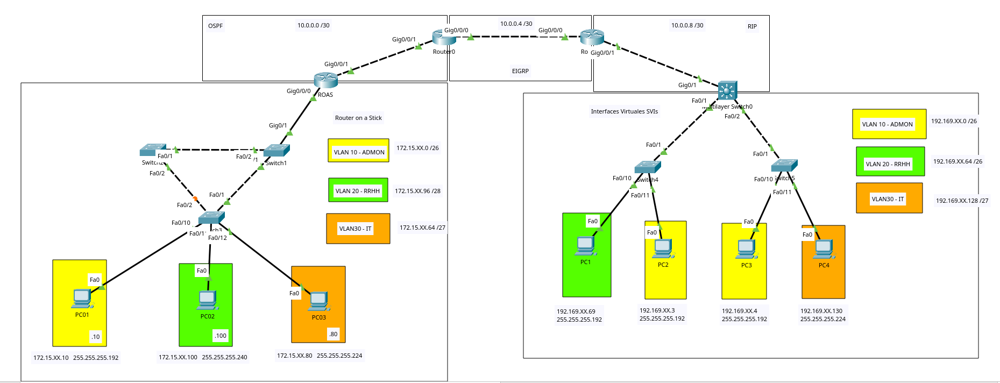

# Contenido Semana 11

- [Alta Disponibilitad (Default Gateway)](#alta-disponibilidad-default-gateway)
  - [Comandos utilizados ejercicio 1](#comandos-utilizados-ejercicio-1)
- [Redistribución de enrutamiento dinamico](#redistribución-de-enrutamiento-dinamico)
  - [Comandos utilizados ejercicio 2](#comandos-utilizados-ejercicio-2)
- [Firewall (LISTAS DE ACCESO EXTENDIDAS)](#firewall-listas-de-acceso-extendidas)
  - [Comandos utilizados](#comandos-utilizados)

# Alta Disponibilidad (Default Gateway)



## Comandos utilizados ejercicio 1
```bash
# Switch0
enable
configure terminal
  vlan 10
    exit
  vlan 20
    exit
  interface FastEthernet 0/10
    switchport mode access
    switchport access vlan 10
    exit
  interface FastEthernet 0/11
    switchport mode access
    switchport access vlan 20
    exit
  interface range GigabitEthernet 0/1-2
    switchport mode trunk
    switchport trunk allowed vlan all
    exit
  exit


# Router0
enable 
configure terminal
  interface GigabitEthernet0/0/0
    no shutdown
    exit
  interface GigabitEthernet0/0/0.10
    encapsulation dot1Q 10
    ip address 192.168.1.2 255.255.255.0
    #HSRP
    standby 1 ip 192.168.1.1 # Esta sera la IP Virtual (Gateway) de esta subinterfaz
    standby version 2
    standby 1 priority 110
    standby 1 preempt
    exit
  interface GigabitEthernet0/0/0.20
    encapsulation dot1Q 20
    ip address 192.168.2.2 255.255.255.0
    #HSRP
    standby 1 ip 192.168.2.1 # Esta sera la IP Virtual (Gateway) de esta subinterfaz
    standby version 2
    standby 1 priority 110
    standby 1 preempt
    exit
  exit


# Router1
enable 
configure terminal
  interface GigabitEthernet0/0/0
    no shutdown
    exit
  interface GigabitEthernet0/0/0.10
    encapsulation dot1Q 10
    ip address 192.168.1.3 255.255.255.0
    #HSRP
    standby 1 ip 192.168.1.1 # Esta sera la IP Virtual (Gateway) de esta subinterfaz
    standby version 2
    standby 1 priority 100
    standby 1 preempt
    exit
  interface GigabitEthernet0/0/0.20
    encapsulation dot1Q 20
    #HSRP
    ip address 192.168.2.3 255.255.255.0
    standby 1 ip 192.168.2.1 # Esta sera la IP Virtual (Gateway) de esta subinterfaz
    standby version 2
    standby 1 priority 100
    standby 1 preempt
    exit
  exit
```

# Redistribución de enrutamiento dinamico

## LINK VIDEO TUTORIAL

[VIDEO TUTORIAL](https://drive.google.com/file/d/1Ie8sDQNuhoabv8lYbNpWejSa8QYMrskw/view?usp=sharing)



## Comandos utilizados ejercicio 2

```bash
# ROAS
enable
configure terminal
  interface GigabitEthernet 0/0/1
    ip address 10.0.0.1 255.255.255.252
    no shutdown
    exit
  # OSPF
  router ospf 100
    network 10.0.0.0 0.0.0.3 area 0
    network 172.15.XX.0 0.0.0.63 area 0
    network 172.15.XX.96 0.0.0.15 area 0
    network 172.15.XX.64 0.0.0.31 area 0 
  exit


# Router0
enable
configure terminal
  interface GigabitEthernet 0/0/1
    ip address 10.0.0.2 255.255.255.252
    no shutdown
    exit
  interface GigabitEthernet 0/0/0
    ip address 10.0.0.5 255.255.255.252
    no shutdown
    exit
  # OSPF
  router ospf 100
    network 10.0.0.0 0.0.0.3 area 0
    # Para distribuir las rutas de eigrp en ospf
    redistribute eigrp 100 subnets
    exit
  # EIGRP
  router eigrp 100
    network 10.0.0.4 0.0.0.3
    no auto-summary
    # Para distribuir las rutas de ospf en eigrp
    redistribute ospf 100 metric 10000 100 255 1 1500
    exit
  exit

# Router1
enable
configure terminal
  interface GigabitEthernet 0/0/0
    ip address 10.0.0.6 255.255.255.252
    no shutdown
    exit
  interface GigabitEthernet 0/0/1
    ip address 10.0.0.9 255.255.255.252
    no shutdown
    exit
  # EIGRP
  router eigrp 100
    network 10.0.0.4 0.0.0.3
    no auto-summary
    # Para distribuir las rutas de rip en eigrp
    redistribute rip metric 10000 100 255 1 1500
    exit
  # RIP
  router rip
    version 2
    network 10.0.0.4
    network 10.0.0.8
    no auto-summary
    # Para distribuir las rutas de eigrp en rip
    redistribute eigrp 100 metric 1
    exit
  exit

# SWITCH Multicapa
enable
configure terminal
  ip routing # Para que funcione como enrutador
  interface GigabitEthernet 0/1
    no switchport
    ip address 10.0.0.10 255.255.255.252
    no shutdown
    exit
  # RIP
  router rip
    version 2
    network 10.0.0.8
    network 192.169.XX.0
    network 192.169.XX.64
    network 192.169.XX.128
    no auto-summary
  exit
```

# Firewall (LISTAS DE ACCESO EXTENDIDAS)

## Comandos utilizados

```bash
# Router ROAS
enable
configure terminal
  # Creando las lista de acceso para la VLAN 10
  ip access-list extended 110 # Las extendidas trabajan entre el 100 y 199
    # <any/permit> <protocolo> <RED_DESDE> <WILD_DESDE> <RED_HASTA> <WILD_HASTA>
    permit ip 172.15.XX.0 0.0.0.63 192.169.XX.0 0.0.0.63
    # Aqui se pueden seguir poniendo redes a las que se desea que tenga comunicación
    deny ip any any
    exit
  # Aplicando el bloqueo en la interfaz o subinterfaz
  interface GigabitEthernet 0/0/0.10
    ip access-group 110 in
    exit

  # Creando las lista de acceso para la VLAN 20
  ip access-list extended 120
    permit ip 172.15.XX.96 0.0.0.15 192.169.XX.64 0.0.0.63
    deny ip any any
    exit
  # Aplicando el bloqueo en la interfaz o subinterfaz
  interface GigabitEthernet 0/0/0.20
    ip access-group 120 in
    exit

  # Creando las lista de acceso para la VLAN 30
  ip access-list extended 130
    permit ip 172.15.XX.64 0.0.0.31 192.169.XX.128 0.0.0.31
    deny ip any any
    exit
  # Aplicando el bloqueo en la interfaz o subinterfaz
  interface GigabitEthernet 0/0/0.30
    ip access-group 130 in
    exit
```

## Video Explicación

[](https://www.youtube.com/watch?v=N8XYMxKWz9E)